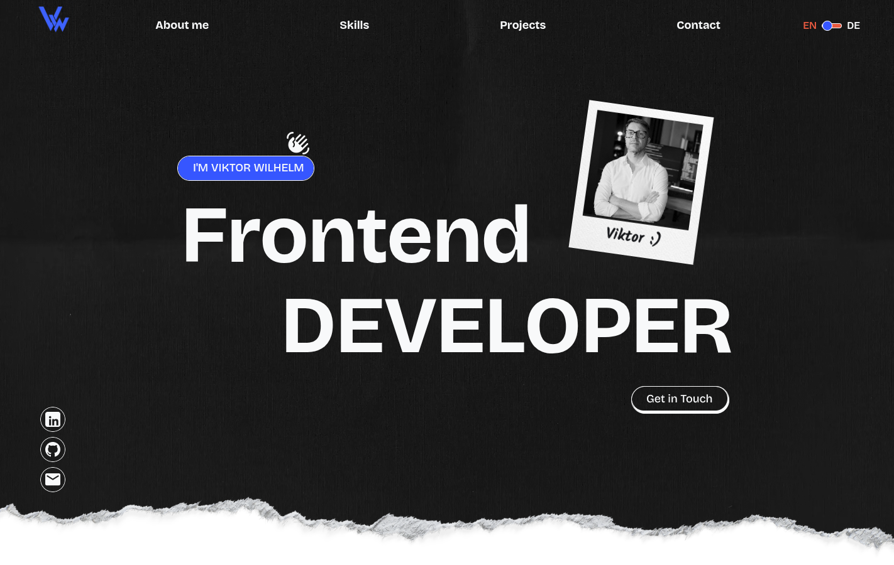

# Portfolio Website

A professional, bilingual (DE/EN) developer portfolio built as a single-page application — no framework, no build step, just clean HTML5, CSS3 and vanilla JavaScript.

[](https://developer.mozilla.org/en-US/docs/Web/HTML)
[](https://developer.mozilla.org/en-US/docs/Web/CSS)
[](https://developer.mozilla.org/en-US/docs/Web/JavaScript)
[](https://www.php.net/)
[](https://git-scm.com/)
[](#tech-stack)

**<a href="https://viktor-wilhelm.de" target="_blank" rel="noopener noreferrer">🔗 Live Demo (opens in a new tab)</a>**

---

## About

This repository holds the source of my personal developer portfolio — the site that introduces me, showcases the projects I've built, and gives recruiters and fellow developers a way to get in touch. It's deliberately built without a framework or bundler to keep the codebase transparent and easy to read end-to-end: every section is plain, semantic HTML styled with CSS custom properties and BEM, brought to life with small, single-purpose vanilla JavaScript modules.

Beyond the visual design, the project reflects how I like to work: consistent naming conventions, a strict component/section split in the CSS, and content that's fully translatable rather than hardcoded to one language.

---

## Preview



---

## Features

- **Bilingual UI (DE/EN)** — every string is translatable, with instant switching and the chosen language persisted via `localStorage`
- **Responsive, mobile-first layout** — dedicated breakpoints at 480px / 768px / 900px, from small phones up to desktop
- **Project detail pages** — dedicated case-study pages per project (description, implementation notes, tech tags, previous/next navigation)
- **Contact form with custom validation** — `blur`-based validation, inline error messages, and a PHP backend (`mail.php`) for sending the message
- **Testimonials section** — feedback from colleagues, presented as hand-styled cards
- **Accessible by default** — semantic landmarks, `aria-label`/`aria-live` where it matters, decorative images marked `aria-hidden`, visible focus states
- **Locally hosted fonts & assets** — no external font or script CDNs

---

## Tech Stack

| Area        | Technology                    |
| ----------- | ------------------------------ |
| Markup      | HTML5 (semantic, accessible)   |
| Styling     | CSS3 (Custom Properties, BEM)  |
| Logic       | Vanilla JavaScript (ES6+)      |
| i18n        | Custom language switcher       |
| Persistence | `localStorage`                 |
| Backend     | PHP (`mail.php`)               |
| Build tool  | None                            |

---

## Project Structure

```
portfolio-app/
├── index.html              # One-page site – all sections
├── project-detail.html     # Project case-study page (per project, via ?query)
├── legal-notice.html       # Imprint
├── privacy-policy.html     # Privacy policy
├── mail.php                # Contact form backend
├── assets/
│   ├── fonts/               # Locally hosted fonts
│   ├── img/                 # Images (max. 500 KB each)
│   └── icons/                # SVG icons & favicon
├── css/
│   ├── variables.css        # CSS Custom Properties (colors, spacing, typography)
│   ├── base.css              # Reset & global styles
│   ├── components/           # navbar.css, footer.css, buttons.css
│   └── sections/              # hero, about, skills, projects, contact,
│                               #   project-detail, project-testimonial-cards
└── js/
    ├── translations.js      # Translation strings (de / en)
    ├── language.js           # Language switcher + localStorage
    ├── header.js              # Header injection + mobile nav overlay
    ├── navbar.js               # Mobile burger menu
    ├── contact-form.js         # onBlur validation & submission
    ├── projects.js              # Projects section logic
    ├── skills.js                 # Skills section logic
    ├── hero.js                    # Hero section logic
    ├── project-detail.js           # Project detail page logic
    └── page-transition.js           # Page fade transition
```

---

## Sections

| Section      | ID            | Description                                          |
| ------------ | ------------- | ----------------------------------------------------- |
| Header       | –             | Navigation + language switcher (DE \| EN)             |
| Hero         | `#hero`       | Fullscreen (100vh) – name, title, CTA                 |
| About        | `#about`      | Photo, bio                                            |
| Skills       | `#skills`     | Tech stack / skill set                                |
| Projects     | `#projects`   | Project cards with live link + GitHub link            |
| Testimonials | –             | Feedback cards from colleagues                        |
| Contact      | `#contact`    | Form with `onBlur` validation                         |
| Footer       | –             | Social links, imprint, privacy policy                 |

---

## Responsive Design

Built mobile-first: base styles carry no media query, with `min-width` queries layering on tablet and desktop refinements at 480px, 768px and 900px. Layout, typography and spacing all adapt across the range rather than just collapsing to a hamburger menu.

## Accessibility

- Semantic HTML (`header`, `nav`, `main`, `section`, `footer`)
- `aria-label` on icon-only links and navigation, `aria-live` on form validation feedback
- Decorative images marked `aria-hidden="true"` with empty `alt`
- Visible `:focus-visible` states on interactive elements

---

## Local Development

**Requirements:** VS Code + [Live Server](https://marketplace.visualstudio.com/items?itemName=ritwickdey.LiveServer), or any static file server.

```bash
# Clone the repository
git clone https://github.com/viktor-wilhelm/portfolio-app.git
cd portfolio-app

# Start Live Server
# index.html → right-click → "Open with Live Server"
# or:
python3 -m http.server 8000
```

Open in browser: `http://localhost:5500` (Live Server) or `http://localhost:8000` (Python server).

> Note: the contact form posts to `mail.php`, which requires a PHP-capable server (e.g. `php -S localhost:8000`) to actually send mail. Static servers like Live Server will show the form's local-dev success fallback instead.

---

## Adding Translations

Add new keys to `js/translations.js`:

```js
const translations = {
  de: { myKey: "Mein Text" },
  en: { myKey: "My text" },
};
```

Reference in HTML with `data-i18n="myKey"`:

```html
<p data-i18n="myKey">My text</p>
```

---

## Git Workflow

```bash
git checkout -b feature/section-name
# ... develop ...
git add .
git commit -m "Add hero section with 100vh layout"
git checkout dev
git merge feature/section-name
```

---

## Documentation

Further documentation is located in [`docs/manual/`](docs/manual/).

---

## Contact

**Viktor Wilhelm** — Frontend Developer

[Portfolio](https://viktor-wilhelm.de) · [GitHub](https://github.com/viktor-wilhelm) · [LinkedIn](https://www.linkedin.com/in/viktor-wilhelm/) · [Email](mailto:hello@viktor-wilhelm.de)
